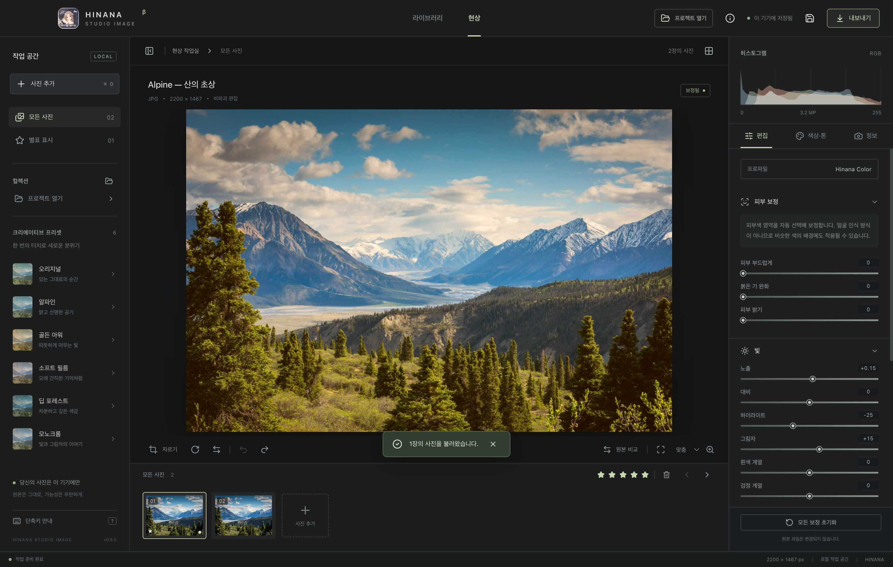

# Hinana Studio Image

Lightroom에서 영감을 받은 한국어 데스크톱 사진 편집기, **v0.6.0**.
기존 `/Users/hinana/HinanaStudio`의 Electron + React + TypeScript + Vite 구조를 참고해 독립된 프로젝트로 만들었습니다. 기존 영상 편집기 코드는 수정하지 않았습니다.



## 바로 실행

Windows x64에서는 `release/Hinana-Studio-Image-0.6.0-Windows-x64-Setup.exe`로 설치합니다. 설치 위치를 선택할 수 있고, 시작 메뉴/바탕화면 바로가기를 만듭니다.

macOS Apple Silicon용 빌드가 있으면 `release/mac-arm64/Hinana Studio Image.app`을 실행합니다.

소스에서 실행하려면 Node.js 24 이상을 권장합니다.

```sh
npm install
npm run dev
```

개발 서버 없이 실행:

```sh
npm run build
npm start
```

브라우저에서만 실행:

```sh
npm run dev:web
```

Electron 실행 파일이 없다는 오류가 나면 `node node_modules/electron/install.js`를 한 번 실행하세요. 개발 서버 기본 포트는 5173입니다.

## v0.6.0 Windows 지원

- Windows x64 NSIS 설치 프로그램과 `npm run pack:win`의 설치 없는 실행 폴더를 제공합니다. Windows 10/11의 64비트 PC를 대상으로 합니다.
- 어두운 상단바에 Windows 최소화/최대화/닫기 버튼 공간을 확보했습니다. 메뉴는 Alt로 열며, 도움말 메뉴에도 프로그램 정보를 넣었습니다. 사진 추가는 Ctrl+O로 표시합니다.
- `.hinanaimage` 프로젝트는 macOS와 Windows가 같은 형식을 사용합니다. 현상된 이미지도 들어 있어 이동 후 다시 RAW를 디코딩하지 않습니다. 자동 저장은 각 기기에 별도로 보관됩니다.
- Windows RAW 처리는 별도 코덱 설치 없이 로컬 Worker에서 실행합니다. 카메라 화이트밸런스, 전체 해상도, 8비트 sRGB 출력이며 120초 제한과 작업 후 Worker 정리를 적용합니다. macOS는 기존 Core Image 엔진을 유지하므로 새 RAW를 열었을 때 두 엔진의 색/크롭 결과가 다를 수 있습니다.
- Windows RAW의 내보내기 EXIF에는 읽을 수 있는 카메라/렌즈/ISO/노출/촬영 시각/작가/저작권/GPS의 표준 항목을 다시 구성합니다. 제조사 전용 MakerNote와 모든 EXIF 항목을 복제하지는 않습니다. 원본 RAW 바이트는 프로젝트에 그대로 보관합니다.
- Windows용 RAW 엔진은 macOS에서도 `HINANA_RAW_ENGINE=wasm node tests/raw-smoke.mjs /absolute/path/to/photo.NEF`로 검증할 수 있습니다.
- GitHub Actions Windows 작업은 단위 테스트 → 설치 파일 빌드 → 패키지 UI 테스트 → 실제 NEF 불러오기/내보내기 테스트를 실행하고 설치 파일을 artifact로 보관합니다. 외부 배포나 업로드된 저장소 생성은 이 작업에서 하지 않았습니다.

## v0.5.0 프리셋 정리와 색상·톤 도구

프리셋은 **왼쪽 사이드바에서만** 제공합니다. 오른쪽 탭은 **편집 / 색상·톤 / 정보**로 구성됩니다.

- **8색 HSL 믹서**: 빨강·주황·노랑·초록·청록·파랑·보라·자홍 중 하나를 선택하고 색조, 채도, 명도를 조절합니다. 인접한 색상은 부드럽게 함께 반영하며 무채색 영역은 색상별 조정에서 제외합니다. 하늘의 파란색을 어둡게 하거나 인형/옷의 특정 색상을 조절할 때 사용할 수 있습니다.
- **톤 커브**: 어두운 영역·중간톤·밝은 영역 슬라이더로 RGB 곡선의 세 제어점을 조절합니다. 그래프가 실시간으로 변하며 검정/흰색 끝점은 고정됩니다. 자유 포인트 추가나 채널별 RGB 커브는 아직 지원하지 않습니다.
- 섹션별 초기화, 슬라이더 더블 클릭 초기화, 원본 비교, 실행 취소/다시 실행, 사진별 저장/복원, 이미지 내보내기에 연동됩니다.
- 기존 프로젝트의 새 보정값은 0으로 복원합니다. 왼쪽 프리셋을 적용하면 색상·톤 도구는 프리셋의 기본 상태로 돌아가며 피부 보정은 유지합니다.

## v0.4.1 프로젝트 열기/확장자 개선

- 상단의 **프로젝트 열기** 버튼 또는 **파일 → 프로젝트 열기…** 메뉴로 저장한 작업을 다시 엽니다. 단축키는 **⌘ / Ctrl + Shift + O**입니다.
- 새 프로젝트는 **`.hinanaimage`** 확장자로 저장합니다. 기존 **`.hinana`** 파일도 변환 없이 계속 열 수 있습니다.
- 프로젝트 파일 하나를 앱에 드래그해서 열 수도 있습니다. 여러 파일을 동시에 놓은 경우 프로젝트를 하나씩 열도록 안내합니다.
- 열기 후 사진, 보정값, 별점, RAW 원본을 복원하고 현상 화면으로 이동합니다. 이전 검색/필터는 초기화합니다.

## v0.4.0 추가 기능

- **상단 브랜드 아이콘**도 사용자 제공 앱 아이콘 이미지로 교체했습니다.
- **RAW 불러오기/현상 (macOS)**: DNG, CR2, CR3, NEF, NRW, ARW, SRF, SR2, RAF, ORF, RW2, PEF, RWL, 3FR, FFF, IIQ, SRW, RAW 확장자를 선택하거나 드래그할 수 있습니다. 실제 지원 여부는 설치된 macOS의 카메라 RAW 지원에 따라 달라집니다.
- `CIRAWFilter.outputImage`로 센서 데이터를 전체 해상도로 현상합니다. 내장 JPEG 미리보기로 대체하지 않습니다. 이후 편집은 기존 **8비트 sRGB** 작업 이미지에서 진행합니다. 센서 선형 데이터에서 다시 계산하는 노출/화이트밸런스 편집이나 16비트 출력은 아직 지원하지 않습니다.
- **RAW 원본도 프로젝트에 포함**합니다. 원본은 수정하지 않으며, 프로젝트를 다시 열 때 저장된 현상 이미지와 편집값을 복원합니다. 정보 탭에서 RAW 작업 여부를 확인할 수 있습니다.
- macOS ImageIO가 읽는 촬영 정보(TIFF/EXIF/GPS)를 현상 PNG로 전달하고, 이미지 내보내기에도 기존 EXIF 보존 옵션을 적용합니다. 제조사 전용 MakerNote 등 일부 항목은 macOS가 전달하지 않을 수 있지만 프로젝트의 RAW 원본 바이트는 보존합니다.
- RAW는 **파일당 120MB / 60MP 이하**입니다. 현상 시간은 최대 120초이며 지원하지 않거나 손상된 파일은 오류를 표시하고 다른 사진의 편집을 유지합니다. RAW와 현상 PNG를 함께 저장하므로 메모리와 프로젝트 파일 용량이 증가합니다.
- v0.6.0부터 Windows/Linux 데스크톱에서는 번들 LibRaw WebAssembly 엔진으로 RAW를 현상합니다. 웹에서는 JPEG·PNG·WebP 또는 이미 현상된 프로젝트를 사용할 수 있습니다.
- 대용량 RAW 자동 저장 중 이전 저장 요청이 늦게 끝나도 최신 편집이 저장된 것으로 잘못 표시하지 않도록 저장 순서와 상태 처리를 수정했습니다.

### RAW 개발 환경 / 테스트

앱 패키지에는 컴파일된 RAW 디코더가 포함됩니다. 소스 빌드에는 macOS의 Xcode Command Line Tools(`xcrun swiftc`)가 필요합니다. `npm run build`가 디코더를 함께 빌드합니다.

```sh
npm run build
node tests/raw-smoke.mjs /absolute/path/to/photo.NEF
```

실제 Nikon D3S NEF(4256×2832)와 Canon EOS DIGITAL REBEL XTi CR2(3888×2592)를 디코딩해 확인했습니다. 모든 카메라 조합을 검증한 것은 아닙니다. 테스트 이미지는 rawpy 프로젝트의 공개 테스트 자료를 임시로 사용했으며 앱에 포함하지 않습니다.

## v0.3.0 추가 기능

- **EXIF 보존 내보내기**: JPEG·PNG·WebP에 원본 EXIF를 기본으로 유지합니다. 내보내기 창에서 체크를 해제하면 EXIF 없이 저장합니다. 카메라/렌즈/노출/촬영 시각과 원본 EXIF의 GPS 등도 유지합니다.
- 회전과 자르기 후 방향을 정상 방향(1)으로 지정하고, 이미지/EXIF 픽셀 크기를 출력 크기로 갱신합니다. 원본의 오래된 썸네일 연결은 제거합니다. sRGB 출력에 맞춰 EXIF ColorSpace를 갱신합니다.
- JPEG APP1, PNG eXIf, WebP EXIF 블록을 사용합니다. EXIF가 없는 원본은 그대로 내보내며, 손상된 EXIF 또는 JPEG 메타데이터 크기 제한 초과는 오류로 안내합니다. 이 경우 보존 체크를 해제하면 이미지 저장을 진행할 수 있습니다.
- 별도 XMP·IPTC·ICC 블록 복사는 지원하지 않습니다. 원본 EXIF는 보존하지만 모든 외부 앱이 PNG/WebP의 EXIF를 표시하는 것은 아닙니다.
- **새 앱 아이콘**: 사용자 제공 이미지를 macOS 앱/Dock과 프로그램 정보 창에 적용했습니다.
- **어두운 통합 상단바**: macOS 창 버튼을 유지하면서 흰 제목 표시줄을 제거하고 헤더를 드래그해 창을 이동할 수 있습니다.
- **상단 ⓘ 프로그램 정보**: 프로그램명, 버전, 개발/제작자 비나래를 표시합니다. macOS 앱 메뉴의 정보 항목에서도 열립니다. Escape 또는 닫기 버튼으로 닫습니다.

## v0.2.0 추가 기능

- **오른쪽 → 정보**: 원본 EXIF의 카메라, 렌즈, 촬영 일시, 셔터 속도, 조리개, ISO, 초점 거리, 노출 보정 등을 표시합니다. 없는 항목은 생략하며, EXIF가 없거나 손상된 사진도 편집할 수 있습니다. 타임존이 없는 촬영 시각은 카메라 현지 시각 그대로 표시합니다.
- **오른쪽 → 편집 → 피부 보정**: 피부 부드럽게, 붉은 기 완화, 피부 밝기를 0–100으로 조절합니다. 피부색 영역에 부드러운 선택 가중치를 적용하며, 큰 윤곽의 차이를 유지하는 양방향 필터를 사용합니다. 낮은 강도에서 시작해 원본 비교로 확인하세요.
- 피부 보정은 얼굴 인식이나 잡티 제거 AI가 아닙니다. 피부와 비슷한 색의 배경에도 적용될 수 있고, 조명과 피부색에 따라 선택 강도가 달라집니다. 부분 브러시/마스크는 아직 없습니다.
- 피부 보정값은 실행 취소, 자동 저장, 프로젝트 파일, 이미지 내보내기에 반영됩니다. 색상 프리셋 변경 시 피부 보정값은 유지합니다.
- v0.1.0 프로젝트/자동 저장 데이터도 열 수 있습니다. 새 피부 보정값은 0으로 보충하며 원본에서 EXIF를 다시 읽습니다.
- EXIF **읽기/표시**를 지원합니다. v0.3.0부터 내보내기 보존도 지원하며, `.hinanaimage` 프로젝트에는 EXIF를 포함한 원본 이미지가 유지됩니다.

## 첫 작업

1. **첫 사진 불러오기** 또는 **샘플 사진으로 둘러보기**를 누릅니다. 파일을 창에 끌어 놓아도 됩니다.
2. 오른쪽에서 노출, 대비, 색온도 등을 조정하거나 왼쪽의 프리셋을 적용합니다.
3. 하단 **원본 비교**로 보정 전후를 확인합니다. **자르기**는 가운데를 기준으로 비율을 적용합니다.
4. **내보내기**에서 형식, 크기, 품질을 정하고 이미지를 저장합니다.
5. 상단 디스크 아이콘으로 원본과 보정값을 포함한 `.hinanaimage` 프로젝트를 저장할 수 있습니다. 왼쪽 **프로젝트 열기**에서 다시 엽니다.

사진과 보정값은 IndexedDB에 자동 저장됩니다. 개발 서버, 웹 브라우저, 빌드된 데스크톱 앱은 저장소가 서로 다릅니다. 작업 공간을 옮길 때는 프로젝트 파일을 사용하세요. 자동 저장 실패는 화면에 표시됩니다.

## 구현된 기능

- JPG/JPEG, PNG, WebP 다중 불러오기 및 드래그 앤 드롭
- 라이브러리 격자, 파일명 검색, 별점, 별표 필터, 필름 스트립
- 노출, 대비, 하이라이트, 그림자, 흰색/검정 계열 보정
- 색온도, 색조, 생동감, 채도, 페이드, 비네팅
- 6개 프리셋: 오리지널, 알파인, 골든 아워, 소프트 필름, 딥 포레스트, 모노크롬
- 90° 회전, 좌우 반전, 중앙 비율 자르기: 1:1, 4:5, 3:2, 16:9
- 원본 비교, 맞춤 및 50/100/150% 확대, RGB 히스토그램
- 사진별 최대 60개 편집 상태, 실행 취소/다시 실행
- 원본 포함 프로젝트 저장/열기, 자동 로컬 저장
- JPEG/PNG/WebP 내보내기, 원본 해상도 또는 긴 변 제한, 압축 품질 설정

## 단축키

| 동작 | 키 |
| --- | --- |
| 사진 불러오기 | ⌘ / Ctrl + O |
| 프로젝트 열기 | ⌘ / Ctrl + Shift + O |
| 프로젝트 저장 | ⌘ / Ctrl + S |
| 이미지 내보내기 | ⌘ / Ctrl + E |
| 실행 취소 | ⌘ / Ctrl + Z |
| 다시 실행 | ⌘ / Ctrl + Shift + Z |
| 원본 비교 | `\` |
| 별점 / 해제 | 1–5 / 0 |
| 이전 / 다음 사진 | ← / → |

슬라이더를 두 번 클릭하면 해당 값만 초기화됩니다.

## 검증과 패키징

```sh
npm test          # 보정 엔진·피부 보정·EXIF 테스트
npm run test:ui   # 실제 Electron 통합 테스트; 별도 임시 작업 공간 사용
npm run build    # TypeScript 검사 + 웹/메인 프로세스 빌드
npm run pack:mac # macOS .app 생성
npm run dist:mac # macOS DMG 생성
npm run dist:win # Windows 설치 파일 생성 (Windows 환경 권장)
```

통합 테스트는 샘플 불러오기, 픽셀 변화, 실행 취소/다시 실행, 원본 비교, 자르기, 별점, 실제 파일 내보내기, 프로젝트 저장, 자동 복원, 검색을 검증합니다. 개발 서버가 필요하지 않습니다. UI 스크린샷은 `docs/`에 생성됩니다.

개발용 macOS 패키지는 Apple 서명/공증을 하지 않습니다. Windows x64 설치 파일 생성과 공통 디코더는 macOS에서 검증했습니다. 실제 Windows 실행/설치 검증은 `.github/workflows/windows.yml`에 준비했으며 이 로컬 작업에서는 실행하지 못했습니다. Linux 배포는 아직 검증하지 않았습니다.

## 첫 버전의 범위

- 8비트 sRGB Canvas 기반 보정입니다. Lightroom의 RAW/색상 처리 엔진과 동일하지 않습니다.
- HEIC/TIFF, 16비트 현상, ICC 워크플로, 부분 마스크, 자유 영역 자르기, 렌즈 보정, 일괄 내보내기는 미지원입니다.
- 일반 사진당 80MB / 60MP 이하(RAW 120MB), 작업 공간당 최대 200장입니다. 실제 수용량은 메모리와 로컬 저장 공간에 따라 달라집니다.
- 맞춤 미리보기는 긴 변 1600px입니다. 확대와 원본 내보내기는 원본 해상도로 처리하므로 대용량 사진에서는 잠시 시간이 걸릴 수 있습니다.
- 비네팅은 출력 크기에 정규화됩니다. 미리보기와 내보내기는 같은 보정 코드를 사용하지만 리샘플링 때문에 픽셀 단위로 완전히 같지는 않습니다.
- 필름 스트립과 라이브러리 썸네일은 원본 사진을 보여 줍니다. 실제 보정 결과는 현상 화면과 내보낸 이미지에 반영됩니다.
- 프로젝트를 다시 열면 최종 보정값을 복원하며 실행 취소 이력은 새로 시작합니다. 자동 복원은 편집 이력을 유지합니다.
- 사진을 외부로 업로드하지 않습니다. 샘플은 앱에 포함되어 오프라인에서도 사용할 수 있습니다.

설계 및 확장 방향: [docs/ARCHITECTURE.md](docs/ARCHITECTURE.md)

## 샘플 이미지

Unsplash의 다음 사진을 로컬 샘플로 포함했습니다.
https://images.unsplash.com/photo-1464822759023-fed622ff2c3b
샘플은 앱 기능을 둘러보기 위한 자료이며 사용자 사진은 별도로 불러옵니다.
